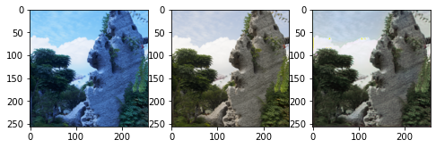
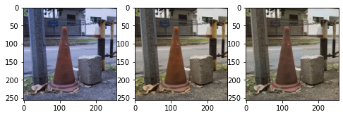
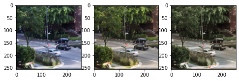
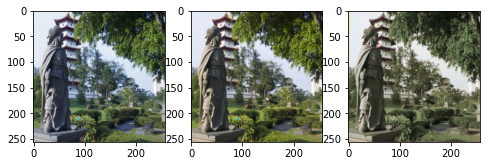
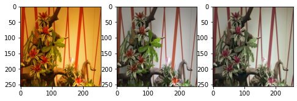
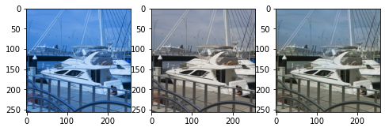

# Deep-Auto-White-Balance
Name: Santosh Vasa, Vikram Bharadwaj  
Date: 10/12/2022  
Class: CS7180 - Advanced Perception  

### Operating System Used:
- Windows for Development - Windows 11
- Linux and Colab for Training 

### How to run? 
- Install requirements.txt   
` pip install -r requirements.txt`
- Add the project folder to the PYTHONPATH: 
`export PYTHONPATH=${PYTHONPATH}:/path_to_project_folder`
- Update parameters.yaml with the data location. 
- link to datasets :  
  - https://cvil.eecs.yorku.ca/projects/public_html/sRGB_WB_correction/dataset.html
- Run python file train.py  
`python3 train.py`
- Time travel days:
  - 2 days
### RESULTS:
Examples: in the order of Input, Ground Truth and Model output 

